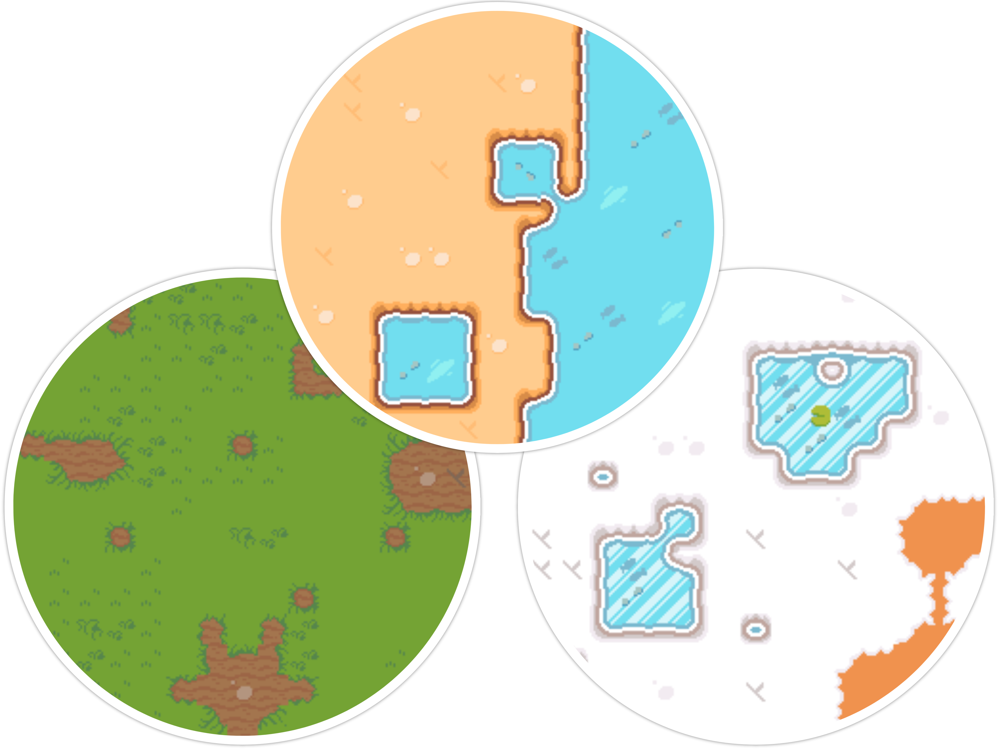

# Lingua Land Mapper

<div align="center">
  
  <br /><br />
  <p><em>Describe a world in words — get back a procedurally generated tile map, streamed in real time.</em></p>
  
  
  
</div>

---

## Table of Contents

- [How it works](#how-it-works)
- [Getting started](#getting-started)
- [How to use](#how-to-use)
- [Roadmap](#roadmap)

---

## How it works

The naive approach — asking an LLM to place every tile on a grid — falls apart quickly. Language models are not spatial reasoners; they hallucinate inconsistent layouts and ignore adjacency rules the moment a map gets large.

The insight here is to split the problem in two:

1. **LLMs are good at relationships.** Given a description and a list of tile types, a model can reason clearly about which tiles should border which — "water should always be edged by sand, never by dense forest." That reasoning is captured as a weighted **transition graph**: a matrix of probabilities over tile-to-tile transitions.

2. **WFC is good at layouts.** [Wave Function Collapse](https://github.com/mxgmn/WaveFunctionCollapse) takes that probability matrix and fills the grid. At each step it picks the uncollapsed cell with the lowest Shannon entropy, samples a tile from its weighted possibility set, and propagates constraints to neighbours via BFS. On contradiction it restarts, up to ten times.

The result is a map that respects the LLM's intent without relying on it to think spatially.

```
Natural language description + tile sprites
              │
              ▼
      ┌───────────────┐
      │      LLM      │  reasons about tile relationships
      └───────┬───────┘
              │ weighted transition graph
              ▼
      ┌───────────────┐
      │      WFC      │  entropy-guided collapse + BFS propagation
      └───────┬───────┘
              │ cell events  (streamed via SSE)
              ▼
          Tile map
```

---

## Getting started

```bash
# Install dependencies
npm install

# Add your OpenAI API key
echo "OPENAI_API_KEY=sk-..." > .env

# Start the server
npm run dev
```

### Try the test script

The repo ships with a ready-made client that generates a 10×10 forest-clearing map (grass, water, sand) and logs progress to your terminal:

```bash
npm run test:flow
```

The LLM's transition matrix is printed once reasoning completes. Each cell collapse is logged as it streams in, and the final map is rendered as emoji once generation is done (🟩 grass · 🟦 water · 🟨 sand).

---

## How to use

Open two terminals.

**Terminal 1 — subscribe to the event stream:**
```bash
curl -N "http://localhost:3000/map/stream?mapId=my-map"
```

**Terminal 2 — trigger generation:**
```bash
curl -X POST http://localhost:3000/map \
  -H "Content-Type: application/json" \
  -d '{
    "mapId": "my-map",
    "query": "A forest clearing with a small pond",
    "availableSprites": [
      { "id": "grass", "description": "Green grass" },
      { "id": "water", "description": "Blue water" },
      { "id": "tree",  "description": "Dense tree" },
      { "id": "sand",  "description": "Sandy shore" }
    ]
  }'
```

The stream emits the following events:

| Event | When | Payload |
|-------|------|---------|
| `graph` | After LLM reasoning | Transition matrix + reasoning text |
| `cell` | Each collapsed tile | `{ x, y, spriteId }` |
| `restart` | WFC contradiction, retrying | `{ attempt, maxRetries }` |
| `done` | Generation complete | — |
| `error` | Unrecoverable failure | `{ message }` |

### Request fields

`POST /map` accepts a JSON body:

| Field | Type | Required | Default | Description |
|-------|------|----------|---------|-------------|
| `mapId` | string | ✓ | — | Unique ID shared with the stream subscriber |
| `query` | string | ✓ | — | Natural language description of the map |
| `availableSprites` | `{ id, description }[]` | ✓ | — | Tile types the map can use |
| `dimensions` | `{ width, height }` | | `15×15` | Grid size in tiles |
| `smoothing` | `"low"` \| `"high"` | | none | Prune low-weight transitions (stricter layouts) |

---

## Roadmap

- **Map editing** — tweak and refine an existing generated map tile by tile
- **Entity generation** — populate maps with objects, NPCs, and other entities
